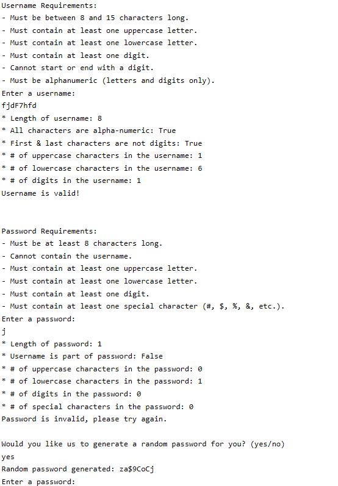

# 🔑 Username-Password-Validator
This Python script validates usernames and passwords based on specific criteria (such as length, character types, and restrictions) and provides a function to generate secure passwords that meet all requirements.
  

## Context
This project was developed as part of a Python course, focusing on building a system for validating usernames and passwords with secure standards. The objective was to ensure that usernames and passwords meet common security requirements, preventing weak credentials. The username validation function checks factors such as length, character variety (uppercase, lowercase, and digits), and ensures the username does not start or end with a digit. Similarly, the password validation function enforces rules for length, inclusion of uppercase and lowercase letters, digits, and special characters. To aid users who struggle to meet these criteria, the system also includes a password generator feature. This project serves as an exercise in applying Python to solve real-world security challenges by creating a tool that ensures user credentials are both secure and easy to manage.

Word Count: 131 words
  

## Analysis and Results
The username and password validation functions effectively met the security requirements outlined. The username validation checks for length, character variety (uppercase, lowercase, digits), alphanumeric characters, and restrictions on starting/ending with digits. The function accurately flagged invalid usernames, considering the username requirements. The password validation function ensured passwords were at least 8 characters long, contained uppercase and lowercase letters, digits, and special characters. It also prevented the inclusion of the username within the password. For example, passwords like "pword123" were flagged for missing special characters, while "Pword123!" was accepted. Additionally, the system offered an option to generate a random password if the user's input did not meet the requirements, helping users create secure passwords easily. However, there are improvements that could be made to the code: adding detailed prompts or error messages could  quickly identify which specific rule the user violated, making it easier for them to correct their input. For example, instead of a generic "Password is invalid," the code could return "Password must contain at least one special character" to provide clearer guidance.

Word Count: 175 words
  

## Output

  

## Language Used
- **Python**
